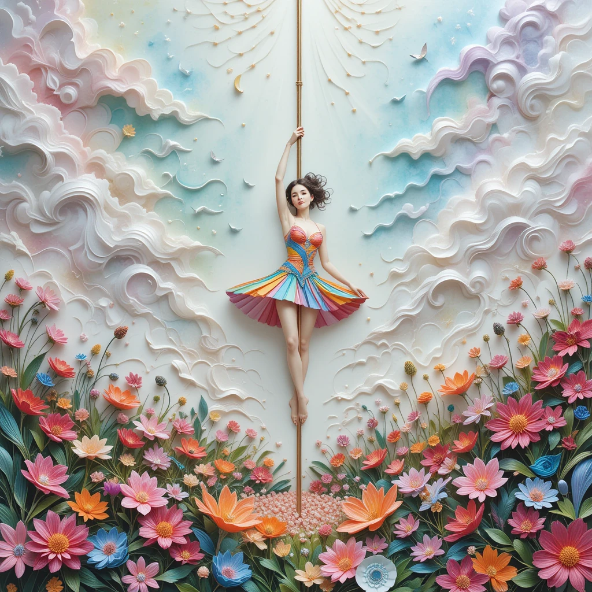

# EBOOK: Conheça o Pole Dance e Descubra seu estilo!
Saude e Bem Estar | Estilo de Vida e Inspiração 

 
Projeto com o objetivo de gerar um ebook digital com as facilidades das ferramentas de IA. todos os prompts
seguem abaixo.

<a href="https://github.com/GabrielleMatosinhoOliveira/prompts-recipe-to-create-a-ebook/blob/main/assets/ebook%20-%20pole1.pdf" title="View PDF now"> 📕Clique aqui para ler</a>

## 💻 Tecnologias utilizadas no projeto

- [ChatGPT](https://chat.openai.com/) - criar título e conteúdo
- [PicLumen](https://piclumen.com/app/image-generator/create) - criar imagem da capa
- [LibreOffice Impress](https://pt-br.libreoffice.org/descubra/impress/) - editar o ebook

## 🧠 Prompts

ChatGPT：

|   Ação   | prompt                                                                                                                                                                                                                                                                         |
| :------: | ------------------------------------------------------------------------------------------------------------------------------------------------------------------------------------------------------------------------------------------------------------------------------ |
|  título  | Crie um título de um ebook sobre o tema de pole dance, o ebook é sobre os tipos de pole dance e o subnicho iniciantes na atividade física, o título deve ser épico e curto, e tenha uma temática alegre no título, me liste 5 variações de títulos                                                         |
| conteúdo | faça um texto para ebook, com foco em pole dance, listando os principais estilos com exemplos de movimentos e exercícios {REGRAS} > Explique sempre de uma maneira simples > Deixe o texto enxuto > Sempre traga exemplos de movimentos e exercícios em contextos reais > Sempre deixe um título sugestivo por tópicos |Ordenar os tipos por Pole Fitness, Pole Flow, Pole Sensual, Pole Exotic, Pole Glamour, Pole Art, Pole Drama, Pole Comedy |Dicas Gerais para Iniciantes no Pole Dance |

PicLumen：

|  Ação  | prompt                                                                                 |
| :----: | -------------------------------------------------------------------------------------- |
| imagem | A mystical 3D watercolor paper quilling art piece depicts a fantasy-dressed woman pole dancer with a colorful top and short skirt, majestically holding onto the pole. The ground is adorned with an exuberant carpet of vibrant flowers and leaves, their petals and tendrils swirling in an enchanting dance. Above, an ethereal sky unfolds, a canvas of soft pastel tones and wispy brushstrokes, infused with a touch of magical realism, as if the very fabric of reality had been woven with wonder. The presence of the pole dancer seems to draw the eye upwards, towards the soft and dreamlike expanse of the sky, where clouds float lazily, like wisps of forgotten memories. In this enchanted realm, the boundaries between reality and fantasy blur, and the beauty of the intricate pole dancer design is elevated to an almost supernatural plane, as if the very essence of magic had been distilled into this singular and captivating work of art. --piclumen -rs 1024:1024 -np "" -g "1" -s "6" -bs "1" -e "89361418500" -st "create" -mn "PicLumen Art V1" |

## 📚 Materiais

- Imagens e ebook gerados em `assets`

---

⌨️ com 💜 por [Gabrielle Matosinho de Oliveira](https://github.com/GabrielleMatosinhoOliveira/) 
